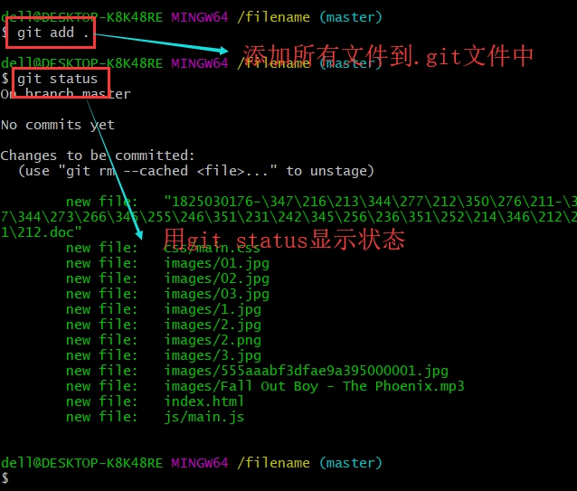
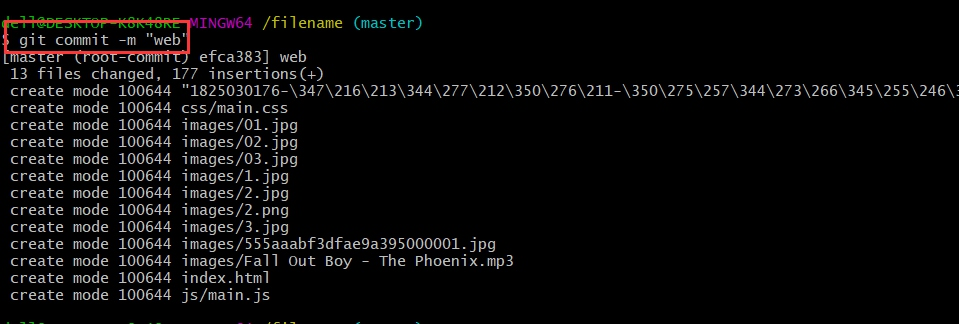
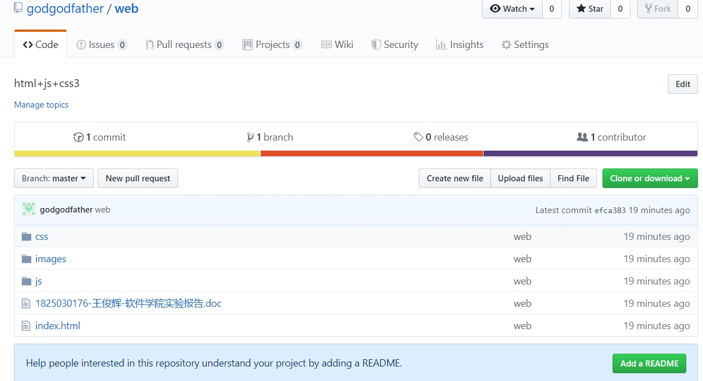
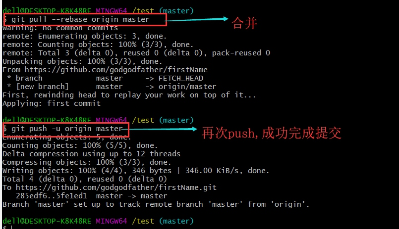

#利用Git bash将本地仓库上传到GitHub
##下载Git
##打开Git bash
界面如下:

###创建一个文件夹
####创建文件夹的两种方式
1. 手动创建
2. 在bash中输入 **mkdir filename**
PS:这个文件夹要么和bash在同一个目录下,要么下面就用绝对路径.
###进入文件
**cd filename**
###通过git init将这个文件夹变成Git可管理的仓库
**git init**

然后会发现在filename文件中有一个.git文件(默认为隐藏,需要设置一下文件查看为显示隐藏文件)
###将自己的项目存放到.git文件中,
####将项目存放到这个仓库中(.git文件中)的两种方式
1. 手动拉入
2. 在bash中输入**git add .** //注意add和.之前有个空格,表示将和.git文件夹同目录的内容拉入到.git中

###提交到仓库
在bash中输入**git commit -m "Here's the comment "**

PS: -m后面是注释,一定要写上,不写会报错,报错原因暂时没有了解
###创建SSH KEY
创建方法见:[link_key][https://blog.csdn.net/u014135752/article/details/79951802]
###打开GitHub创建新project

###在bash将Git上的仓库和本地仓库连接起来
在bash中输入 **git remote add origin + GitHub**上面复制的网址

###将本地仓库内容推送到GitHub上面
在bash中输入git push -u origin master //*-u是GitHub上项目为空的时候,如果不为空则直接git push origin master就可以*

###最后刷新GitHub项目已经完成

###在GitHub上创建项目的时候如果勾选了最后一项创建一个ReadMe报错的解决方法
报错如图:

**解决方法**
1. 在bash输入 **git pull --rebase origin master**
2. 在bash中输入**git push -u origin master**

